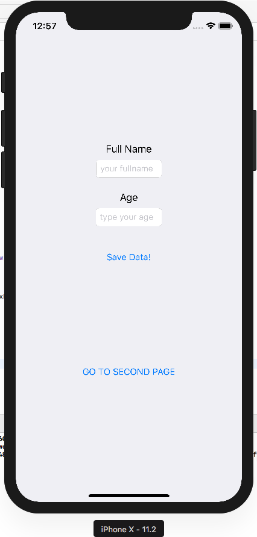
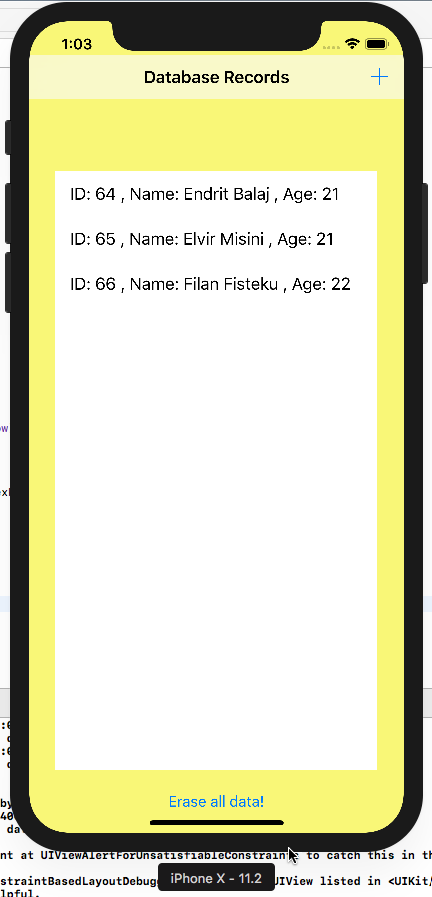
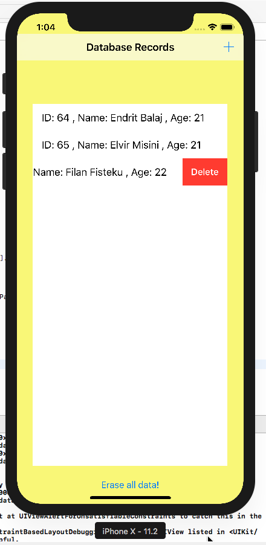

# MobileApp-IOS
Ky aplikacion eshte ndertuar nga gjuha programuese Swift.  

## Tabela e Permbajtjes
* [Hyrje](#hyrje)
* [Funksionet](#funksionet)
* [Ilustrimi](#ilustrimi)
* [Instalimi](#instalimi)
* [Te dhena shtese](#tedhenashtese)
## Hyrje
Ky aplikacion eshte ndertuar per paisjet mobile me sistem operativ IOS. Ky aplikacion eshte nje aplikacion shume i thjesht i cili ka mundesi qe te zgjerohet ne te ardhmen me shume. Ne kete aplikacion mundemi te futim te dhena ne databaze dhe te fshijm ato. Gjithashtu mund te navigojme nga nje view tek tjetra. Screenshots te marrur nga simulimi ne nje  makine virtuale.

## Funksionet
Ky projekt permban keto funksione:
* Shtimi i te dhenave ne databaze;
* Fshirja e te dhenave nga databaza;

## Ilustrimi
* Faqja e pare: Ne faqen e pare ne kemi mundesi qe te shtojme te dhenat dhe ti ruajm ato, kemi dy fusha: 1) Fusha "Full Name" 2) Fusha "Age" ku duhet te shenojme emrin dhe moshen, me posht kemi nje buton qe na mundeson ruajtjen e te dhenave ne databaze dhe krejt ne fund kemi edhe nje buton i cili na dergon tek faqja e dyte.

* Te dhenat: Ne kete dritare ne kemi mundesi qe ti shohim te dhenat qe kemi futur ne databaze, ku gjithashtu ne mundemi me i fshi te gjitha te dhenat me butonin ne fund te dritares ose te i fshijm nje nga nje manualisht( swipe-left -> Delete) si ne figurat ne vazhdim.

## Instalimi
Ky aplikacion duhet te klonohet apo te behet download dhe me pas te lidhet me nje lidhje fizike ndermjet PC dhe nje paisje mobile IOS qe te mund te instalohet ne telefon, ose mund edhe te simulohet virtualisht nga XCode.

## Te dhena shtese
* Ky aplikacion eshte krijuar si projekt per vlersimin e studenteve qe kane punuar ne kete projekt ne lenden Paisje Mobile ne kuader te departmentit te Inxhinierise Kompjuterike(ne FIEK) ne Universitetin e Prishtines(Hasan Prishtina).
* Te dhenat e zhvilluesve:
 Elvir Misini:  https://github.com/elvirmisini
  https://www.linkedin.com/in/elvir-misini-479547202/
 Endrit Balaj:  https://github.com/endritbalaj
  https://www.linkedin.com/in/endrit-balaj-87610a206/
